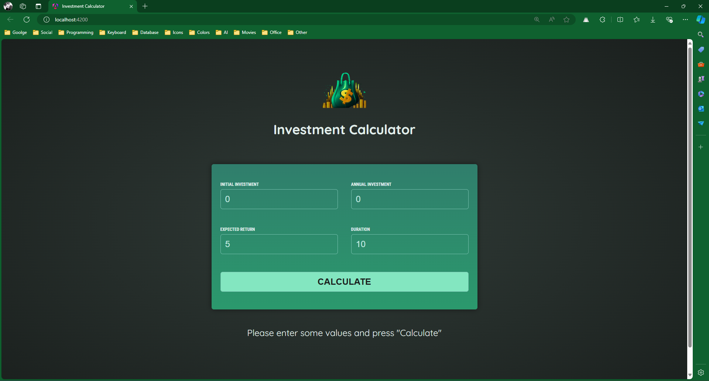
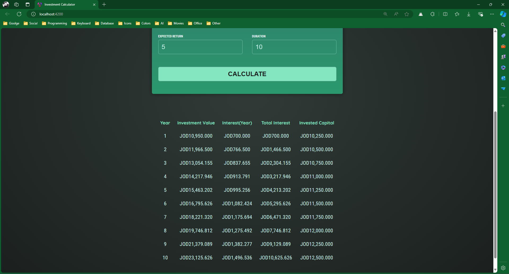

# Investment Calculator

**Investment Calculator** is a web application designed to help users calculate the future value of their investments. It features a user-friendly interface and provides detailed results for better financial planning.

## Features

- **Header Component**: Displays the application title and logo.
- **User Input Component**: Collects investment details from the user through a form.
- **Investment Results Component**: Shows the calculated investment results in a detailed table.
- **Two-Way Data Binding**: Utilizes Angular's two-way data binding for form inputs.
- **Dependency Injection and Services**: Handles calculations through Angular services.
- **Modular Architecture**: Structured with Angular modules for scalable development.
- **Signal Usage**: Implements signals in various components for state management.

## Setting Up

To get started with this repository:

1. Clone the repository to your local machine.
   - `git clone https://github.com/dev-khaled-yousef/investment-calculator.git`

2. Install dependencies using npm.
   - `npm install`
   
   This will install all necessary packages and dependencies required for the Angular project.

3. Start the development server.
   - `npm start`
   
   This command will compile the application and open it in your default web browser. If it doesn't open automatically, you can navigate to [http://localhost:4200/](http://localhost:4200/) in your browser.

## Screenshots

Here are some screenshots of the application:

### Main Interface

### Investment Results

## Usage

- **Enter Investment Details**: Fill in the initial investment, annual investment, expected return, and duration.
- **Calculate Results**: Click the "Calculate" button to view the investment results.
- **Review Results**: The results will be displayed in a table, showing the year-by-year investment value, interest, total interest, and invested capital.

Feel free to contribute to the project by opening issues or submitting pull requests. For any queries, contact us at `khalidsliman2014@gmail.com`.
